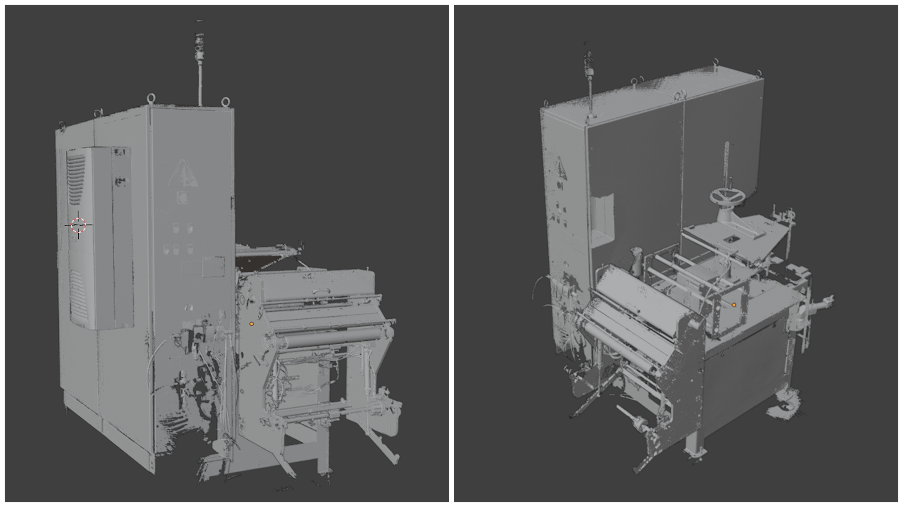
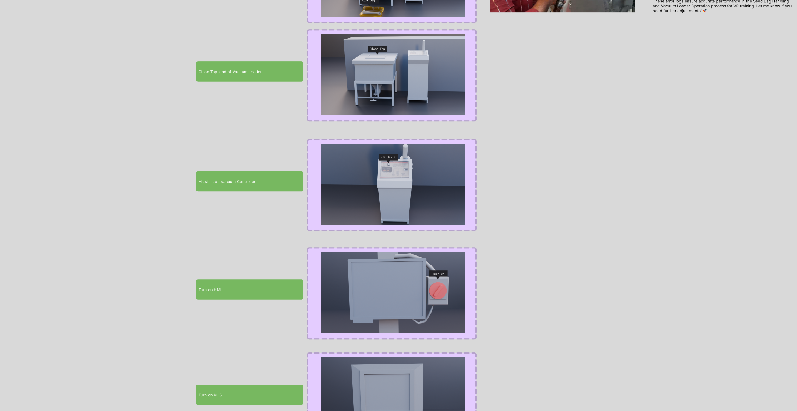
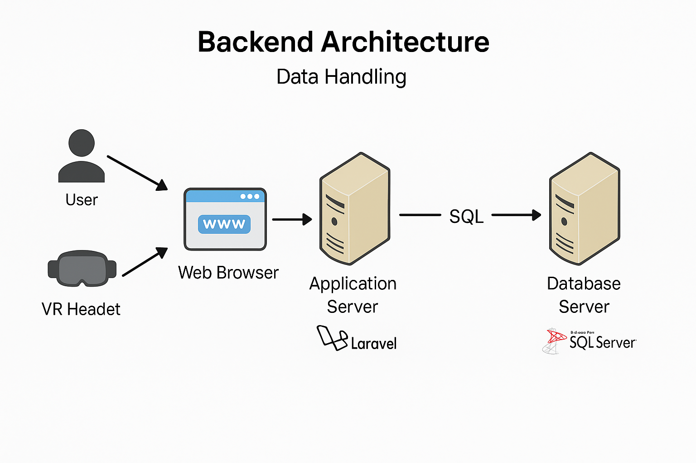

# 🌾 Bayer VR Learning Module Simulator

The **Bayer VR Learning Module Simulator** is an **enterprise-grade virtual reality training solution** built to replicate the **seed packaging line process with high accuracy**.  

This system allows **trainees to learn, practice, and be assessed** in an interactive VR environment, while **administrators gain real-time visibility of progress** through a secure intranet-based dashboard.  

What if trainees could **step into a fully scanned packaging line**, interact with machinery, and follow workflows safely in VR **without interrupting live production**?  
What if administrators could **monitor every trainee’s progress, quiz results, and session status in real time** through a **secure internal dashboard**?  
What if training could be **modular, language-friendly, and trackable**, ensuring both trainees and administrators gain **clear insights into performance and progress**?  

This project brings together **LIDAR scanning, Unity XR Toolkit, AutoHands package, multilingual support, and custom backend APIs** to deliver a **complete VR learning ecosystem**.  

[▶ Watch Gameplay Demo Video](https://drive.google.com/file/d/1w_0QkdpbJNrvyqJFYwUBhMpEMUiH3LDN/view?usp=drive_link)

---

## 📑 Contents
- [🌍 Overview](#-overview)  
- [🔄 Workflow Summary](#-workflow-summary)  
- [🏗 Virtual Environment](#-virtual-environment)
- [🔊 Audio](#-audio)  
- [🗣 Multilingual Support](#-multilingual-support)  
- [🎮 User Interaction](#-user-interaction)  
- [📝 Quizzing System](#-quizzing-system)  
- [🔗 Backend Integration](#-backend-integration)  
- [📊 Admin Dashboard & Trainee Panel](#-admin-dashboard--trainee-panel)  
- [🎯 Technology Stack](#-technology-stack)  
- [✅ Outcome](#-outcome)  
- [🔐 Data Privacy & Security](#-data-privacy--security)  

---

## 🌍 Overview
The training program is divided into **four VR modules**, each further broken down into **short chapters (under 7 minutes)** to minimize VR fatigue while ensuring effective learning:  
1. Packaging Roller  
2. Production Process  
3. Labelling & Packaging Workflow  
4. Hybrid Changeover Process  

Learners log in with allocated accounts, select their **preferred language (English or Telugu)**, and progress through interactive workflows.  
➡️ Each chapter ends with a **5-question quiz** to reinforce knowledge.  

---

## 🔄 Workflow Summary
- **Process Understanding** → Gathered operational details of the seed packaging line directly from client inputs  
- **UX Flow (Figma)** → Designed training structure with modules mapped to client workflows  
- **3D Capture & Modeling** → Used **LIDAR and cameras** to scan the packaging line; optimized via Blender retopology  
- **Unity Development (URP + XR Toolkit + AutoHands)** → Developed VR modules using **C# scripts** and **AutoHands** for natural VR hand interactions  
- **Scene Setup** → Imported optimized 3D assets, applied materials, configured lighting for realism  
- **Backend Integration** → Built **custom APIs** for Unity ↔ intranet server communication with JSON-based data exchange  
- **Progress Tracking** → Unity sends **progress updates every 60 seconds** for granular monitoring of interactions  

---

## 🏗 Virtual Environment
- Real-world packaging line **scanned via LIDAR + cameras**  
- Retopologized in **Blender** for performance-optimized VR assets  
- Imported into **Unity URP** for interactive simulation  

---

## 🔊 Audio
- To mimic the **floor environment ambiance**, we added **sound effects** to all equipment and machinery, just like in the **real-world seed packaging line**.  
- This addition makes the VR training experience even **more immersive and realistic**, allowing trainees to feel fully present in the simulated environment.  

---

## 🗣 Multilingual Support
- Trainee can choose **English or Telugu** at login  
- Ensures **accessibility for regional and global trainees**  

---

## 🎮 User Interaction
- Developed with **Unity XR Toolkit + AutoHands package**  
- Natural **VR hand interactions** for handling equipment  
- **Process-driven interactions** mapped directly to real workflows  

---

 
<a href="https://www.figma.com/design/TtAuN9sTaX7X76bN5hEnjY/Bayer-VRLMS-M2_A?node-id=0-1&t=1Ysy1YMdjUnbOMrJ-1" target="blank">▶ Click here to explore the module’s UX flow</a>

---

## 📝 Quizzing System
- Each chapter ends with a **5-question quiz (5 marks total)**  
- **Scoring Rules**:  
  - 1 mark → correct first attempt  
  - 0.5 mark → correct second attempt  
- Results displayed instantly and logged to backend  

---

## 🔗 Backend Integration
- Custom **intranet-based backend server** for account and data management  
- APIs created for Unity to **send/receive JSON data securely**  
- Player progress updates sent **every 60 seconds** (including interaction completions)
<a href="https://github.com/PravanjanFE/Bayer_VR_LearningModuleSimulator/blob/main/github_assets/Backend_Laravel%20_Client_Server_Setup_Documentation.docx" target="_blank" rel="noopener noreferrer">
📘 Documentation for more information
</a>

 🧩 Architecture Diagram

---

## 📊 Admin Dashboard & Trainee Panel

### 🛡️ Admin Panel Features
- Leaderboard  
- User reports (login logs, chapter status, quiz data, progress)  
- Trainee account management  

### 👨‍🎓 Trainee Dashboard
- Personal progress tracking  
- Quiz results and performance overview  

---

## 🎯 Technology Stack

### 🔹 Frontend
- Unity C# + XR Toolkit  
- Blender (3D optimization)  
- Figma (UX flow design)

### 🔹 Backend
- Framework: Laravel (PHP 10.x compatible)
- Database: MySQL 
- Frontend Integration: JSON response format
- Authentication: Laravel Passport / Sanctum for token-based authentication
- Server: Apache 
- Version Control: Git & GitHub for source management
- Environment Management: .env configuration for secure deployment
- PDF & Report Generation: dompdf / barryvdh-laravel-dompdf
- Scheduler & Queue Handling: Laravel Scheduler, Redis / Queue Jobs
- Deployment Environment: On-premise or cloud-based web server (Windows)

## 🧩 Challenges & Solutions

| **Challenge** | **Description** | **Solution Implemented** |
|----------------|-----------------|---------------------------|
| **Database Connectivity** | Connecting Laravel application to a remote MySQL server securely. | Configured `.env` with remote host IP, enabled MySQL remote access, and used firewall rules for controlled access. |
| **Data Accuracy in Reports** | Inconsistent progress and time calculations for users. | Introduced a centralized `CalculationService` for accurate data aggregation. |
| **PDF Export Formatting** | Misalignment in generated reports. | Developed dedicated Blade templates for each report type. |
| **Role-Based Data Access** | Difficulty managing admin and user permissions. | Implemented middleware with Laravel Gates and Policies. |
| **Large Data Processing** | Slow performance with large datasets. | Applied query optimization, eager loading, and pagination techniques. |

---

## ✅ Outcome
The **Bayer VR Learning Module Simulator** provides a **safe, interactive, and trackable VR training solution** for **seed packaging line operations**.  

With **multilingual support, structured modules, quizzes, and real-time backend reporting**, it ensures:  
- Trainees gain **hands-on experience** in VR  
- Administrators maintain **complete oversight** of progress and performance  

👉 A secure, **enterprise-ready VR training ecosystem**.  

---

## 🌐 Company Website
Visit us at [FourEdges.io](https://fouredges.io/)

---

## 🔐 Data Privacy & Security
Our **data handling approach** prioritizes **client data sovereignty** through:
- **Comprehensive security controls**  
- **Transparent operational practices**  

All solutions operate **within client infrastructure**, ensuring:  
- Complete **data ownership and control**  
- Maintenance of **enterprise-grade security standards** throughout the **project lifecycle**  

---
